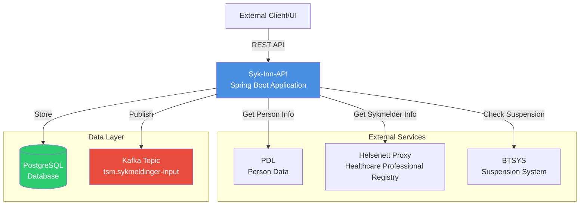
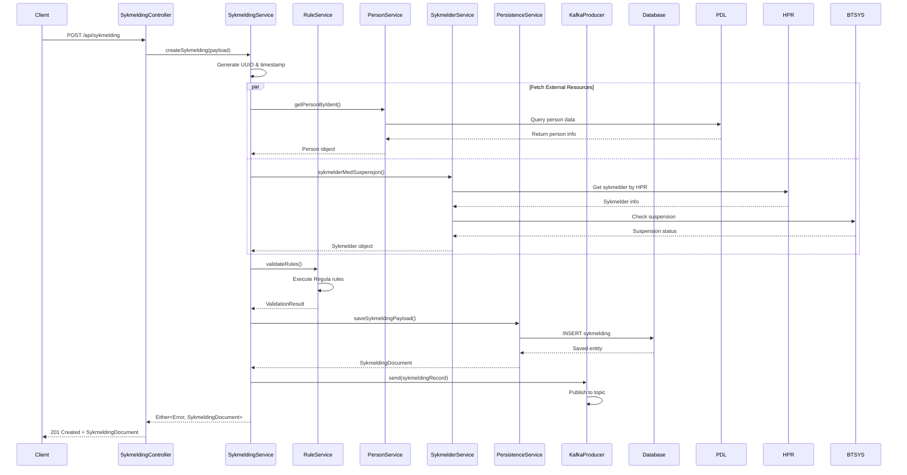
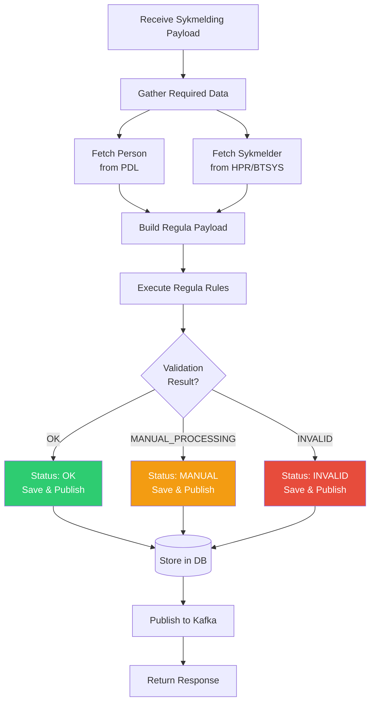
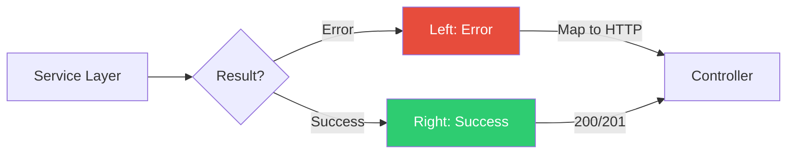

# syk-inn-api

## Technology Stack

- **Language**: Kotlin 2.2.0
- **Framework**: Spring Boot 3.5.4
- **Build Tool**: Gradle with Kotlin DSL
- **Database**: PostgreSQL 16 with Flyway migrations
- **Message Broker**: Apache Kafka
- **Security**: OAuth2 with JWT (Azure AD)
- **PDF Generation**: OpenHTMLToPDF with PDF/A validation
- **JVM**: Java 21

## Key Dependencies

- **Regulus**: Business rule validation engine (`no.nav.tsm.regulus:regula`)
- **Sykmelding Input**: Kafka message definitions (`no.nav.tsm.sykmelding:input`)
- **Arrow**: Functional programming with Either types for error handling
- **Spring Data JPA**: Database persistence
- **Spring Kafka**: Kafka integration
- **Testcontainers**: Integration testing

---

## High-Level Architecture



### Prerequisites

(Use mise? `mise i` to install the required prerequisites)

- Java 21

You will also need docker installed for running the application locally, and running tests with testcontainers.

### Building the application

1. Start infrastructure: `docker-compose up -d`
2. Run:
   1. Run in IntelliJ - set profiles local and def-kafka
   2. Run with local profile: `./gradlew bootRun --args='--spring.profiles.active=local,dev-kafka'`
4. External services are mocked (no real PDL, BTSYS, HPR calls)

This will run tests as well.

### Inspecting topics

Kafka will run in docker. To query the local Kafka instance you can use the following command to check for
content in the topic::

``` bash
kcat -b localhost:9092 -t tsm.sykmeldinger-input -C -o beginning
```

#### Colima sidenote

Ensure Testcontainers has access to Docker by adding this to your configuration
```
export TESTCONTAINERS_DOCKER_SOCKET_OVERRIDE=/var/run/docker.sock
export DOCKER_HOST="unix://${HOME}/.colima/docker.sock"
export TESTCONTAINERS_HOST_OVERRIDE=$(colima ls -j | jq -r '.address')
```

# Architecture

## Application Flow - Create Sykmelding


---

## Rule Validation Flow



## Error Handling Strategy

The application uses **Arrow's Either type** for functional error handling:

```kotlin
Either<Error, Success>
```

**Error Types**:
- `SykmeldingCreationErrors.PersonDoesNotExist`: Patient not found in PDL
- `SykmeldingCreationErrors.PersistenceError`: Database save failed
- `SykmeldingCreationErrors.ResourceError`: External service call failed

**Error Flow**:


## Contact

This project is maintained by [navikt/tsm](CODEOWNERS)

Questions and/or feature requests?
Please create an [issue](https://github.com/navikt/syk-inn-api/issues)

If you work in [@navikt](https://github.com/navikt) you can reach us at the Slack
channel [#team-sykmelding](https://nav-it.slack.com/archives/CMA3XV997)
