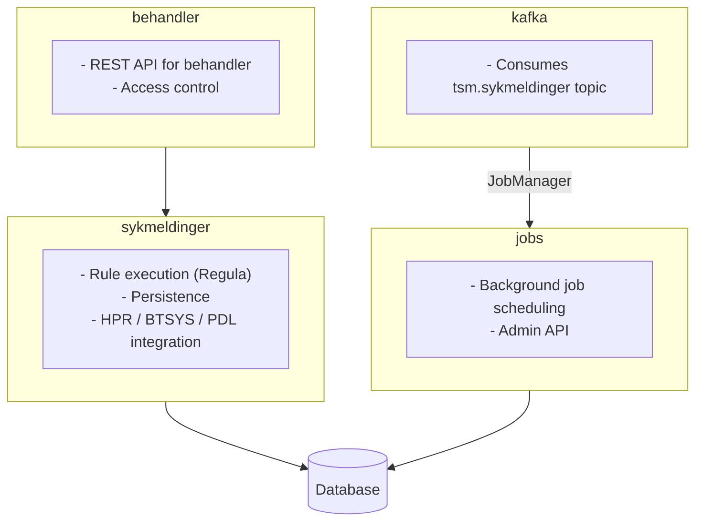

# syk-inn-api

Backend service for [syk-inn](https://github.com/navikt/syk-inn) responsible for receiving and processing sykmeldinger,
and publishing them for downstream applications on kafka.

Primary responsibilities:

* Validate payloads from syk-inn
* Execute the [sykmeldinger rule tree](https://github.com/navikt/regulus-regula) with required metadata
* Persist the sykmeldinger and their processing status in the database
* Publish the sykmeldinger on kafka for downstream applications to consume

## Development

### Tech stack and architecture:

This application is built using:

* Ktor
* Exposed
* arrow-kt-core
* Apache kafka-client

The application structure is "modular" where outside of some basic global configuration, each Ktor-module
provides any routes, services, repositories and database tables it needs. The entry point Application.kt only configure


```mermaid
graph TD
    subgraph behandler
        B["- REST API for behandler\n- Access control"]
    end

    subgraph sykmeldinger
        S["- Rule execution (Regula)\n- Persistence\n- HPR / BTSYS / PDL integration"]
    end

    subgraph kafka
        K["- Consumes tsm.sykmeldinger topic"]
    end

    subgraph jobs
        J["- Background job scheduling\n- Admin API"]
    end

    DB[("Database")]
    behandler --> sykmeldinger
    kafka -- " JobManager " --> jobs
    sykmeldinger --> DB
    jobs --> DB
```

### Use arrow-kt-core for logical errors

This Ktor application uses the [arrow-kt-core](https://arrow-kt.io/learn/typed-errors/) for strongly typed errors.
To be able to work with this application you should have a fundamental grasp of the following arrow-kt concepts:

* Core usage:
    * [Working with typed errors](https://arrow-kt.io/learn/typed-errors/working-with-typed-errors)
    * [Logical failure vs real exceptions](https://arrow-kt.io/learn/typed-errors/working-with-typed-errors/#concepts-and-types)
    * [Raising errors](https://arrow-kt.io/learn/typed-errors/working-with-typed-errors/#raising-an-error)
* [Either](https://arrow-kt.io/learn/typed-errors/wrappers/either-and-ior/)
* [Either vs Raise APIs](https://arrow-kt.io/learn/typed-errors/from-either-to-raise/)

In general, any code that is has expected failures, i.e. we can have a reasonable expectation of that they can happen,
i.e. an external API returning unexpected error codes, we should represent them as the "left" side, using Raise or
Either.

Example of "typical code" where we would like to represent the expected failures:

```kotlin
// We can use enums for simple errors, or sealed classes for more complex errors
enum class FooErrors {
    ServiceUnavailable,
    InvalidData,
    // ...
}

// The happy path (right) returns a string, the error path returns a specific error of the enum type 
fun doFooBarBaz(): Either<FooErrors, String> = either {
    // ...
    if (/* some condition */) {
        raise(FooErrors.ServiceUnavailable)
    }

    if (/* some other condition */) {
        // Can also return directly using .right() extension function instead of raise
        return FooErrors.InvalidData.right()
    }

    // ...
    goodResult.left()
}
```

More "typical" code, i.e. pure functions where all we need is the Kotlin compiler, we can avoid
using any arrow-kt code. We should strive to keep the usage of arrow-kt to a minimum, and only use it in the places
where we have expected failures.

```kotlin
// No either needed, anything that could happen wrong in this function are actual _exceptions_, which is fine.
fun mapFromFooToBaz(foo: Foo): Baz {
    // some complex mapping ...
    return baz
}
```

### Running locally

Run in development to enable hot reloading and stubbed external dependencies:

With gradle :

```bash
./gradlew runLocal
```

In IntelliJ:

There is a run configuration checked into the repository using modern IntelliJ `.run` folder. You should already
have a runnable run-configuration in IntelliJ.

If not you can refer to the manually configure it:

In IntelliJ run configuration, first run the main function, then edit it to add `-Dio.ktor.development=true` to the VM
options, and `-config=application-local.conf` in "program options".
